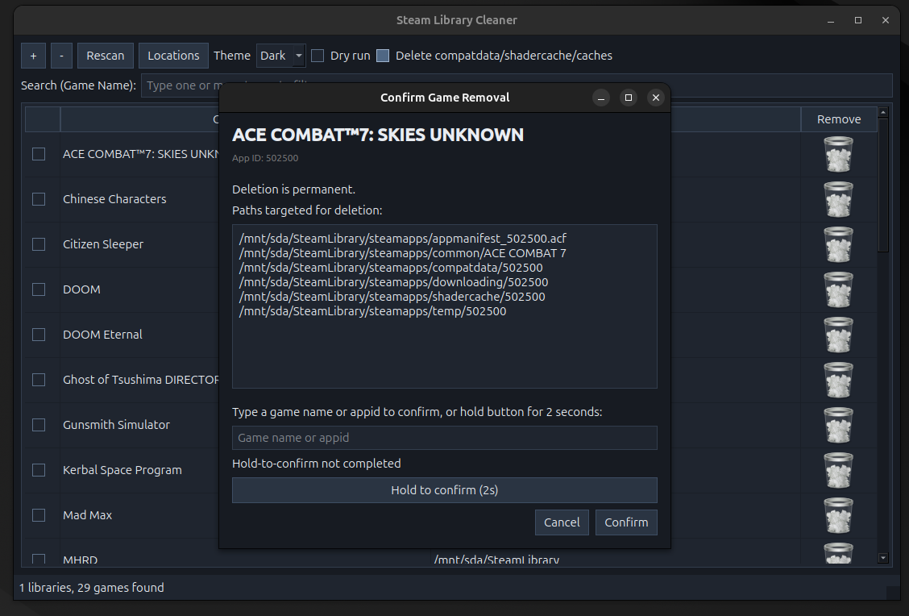
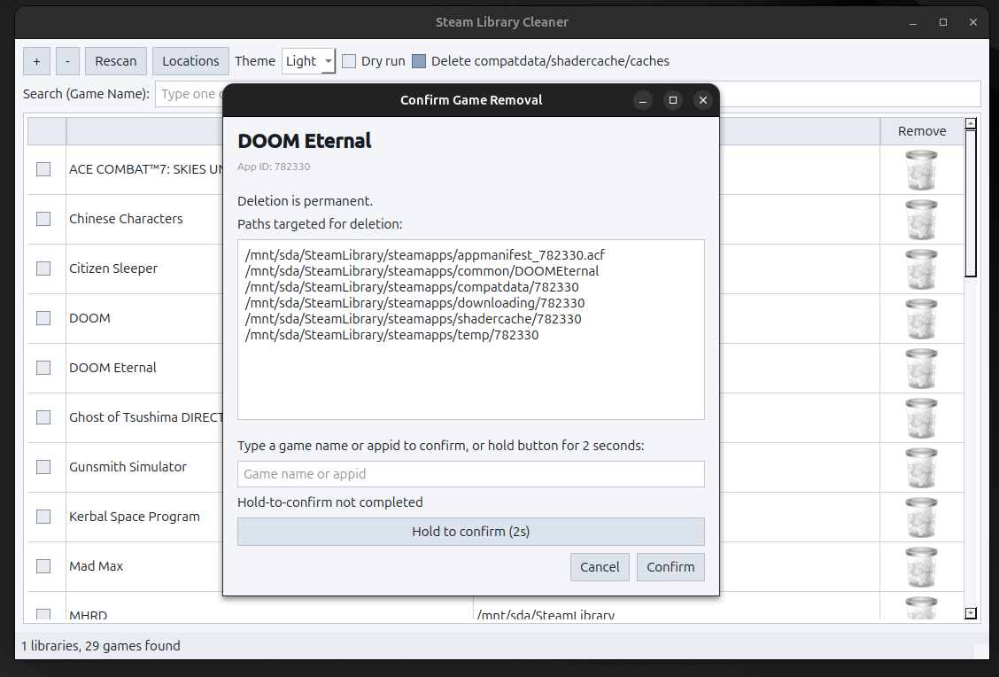

# Steam Library Cleaner (`steam-man`)

## Wow section

 

## Description

Desktop app to scan Steam libraries on Linux and remove broken/unwanted installs directly from disk.

## Requirements

- Python 3.10+

## Setup Virtual Environment (`smanenv`)

```bash
python3 -m venv smanenv
./smanenv/bin/pip install -r requirements.txt
```

## Run

Preferred (always uses `smanenv`):

```bash
./run.sh
```

Alternative:

```bash
./smanenv/bin/python main.py
```

## What It Does

- Add one or more mount points via `+`.
- Detects Steam library roots by checking:
  - `<mount>` if it contains `steamapps`
  - `<mount>/SteamLibrary`
  - shallow subdirectories (depth 2) with `steamapps`
- Reads `steamapps/appmanifest_*.acf` and extracts:
  - `appid`
  - `name`
  - `installdir`
- Builds install path as:
  - `<library_root>/steamapps/common/<installdir>`
- Shows broken states (missing install directory / parse errors).

## Deletion Behavior

For each game, removal targets are:

- `<library_root>/steamapps/common/<installdir>`
- `<library_root>/steamapps/appmanifest_<appid>.acf`

Optional cleanup (enabled by default via checkbox):

- `<library_root>/steamapps/compatdata/<appid>`
- `<library_root>/steamapps/shadercache/<appid>`
- `<library_root>/steamapps/downloading/<appid>`
- `<library_root>/steamapps/temp/<appid>`

Safety controls:

- Confirmation dialog lists exact paths.
- Confirmation requires either:
  - typing a selected game name/appid, or
  - holding a button for 2 seconds.
- If Steam process is detected, extra confirmation is required.
- `Dry run` previews operations without deleting files.

## UI Summary

- `+` add mount point
- `-` remove checked rows
- `Trash` button per row for single-game removal
- `Rescan` all added mount points
- Theme toggle: `Auto` / `Light` / `Dark`
- Search filter by game name
- Status bar: total libraries and games

## Notes

- The app uses filesystem operations only; Steam API is not required.
- Deletion is best-effort and reports per-path failures.
- Permissions and file locks can prevent complete cleanup; failed entries remain for retry.

AI Generated using: gpt-5.3-codex (2026-02-28 23:53:31 UTC)
